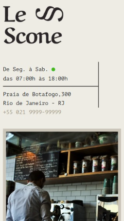

<h1 align="center">
  
</h1>

<h3 align="center">
  Curso realizado na origamid - Edu Souza o/
</h3>

<blockquote align="center">“A vida não se acaba quando deixamos de viver e sim quando deixamos de buscar algo nela! - Bob Marley”</blockquote>

<h4 align="center">
  Repositório - CSS com SASS
</h4>

 

  &nbsp;
  &nbsp;
  

  <a href="#rocket-Sobre-o-curso">Sobre o curso</a>&nbsp; &nbsp; |&nbsp; &nbsp; 
  <a href="#postbox-Entrega"">Entrega</a>&nbsp; &nbsp; |&nbsp; &nbsp; 
  <a href="#unlock-Licença">Licença</a>

## :rocket: Sobre o curso

#### CSS Com SASS

No curso de CSS com SASS você irá aprender como criar variáveis, mixins, funções, loops e outras funcionalidades que vão tornar a codificação do seu CSS mais eficiente e divertida.

A primeira parte do curso é focada nos fundamentos do SASS, como instalar ele e como utilizar as suas funções. Na segunda parte vamos para a prática, é nessa parte que você percebe o quanto o SASS é bom.

#### Screenshots:

   &nbsp;  
  

## :postbox: Entrega

#### Concluido :clipboard:

Acesse o deploy do projeto [aqui](https://edusouza-programmer.github.io/css_grid_layout-origamid/).

# 
## :unlock: Licença

Este projeto está licenciado sob a Licença MIT - consulte [LICENSE](https://opensource.org/licenses/MIT) para maiores detalhes.
